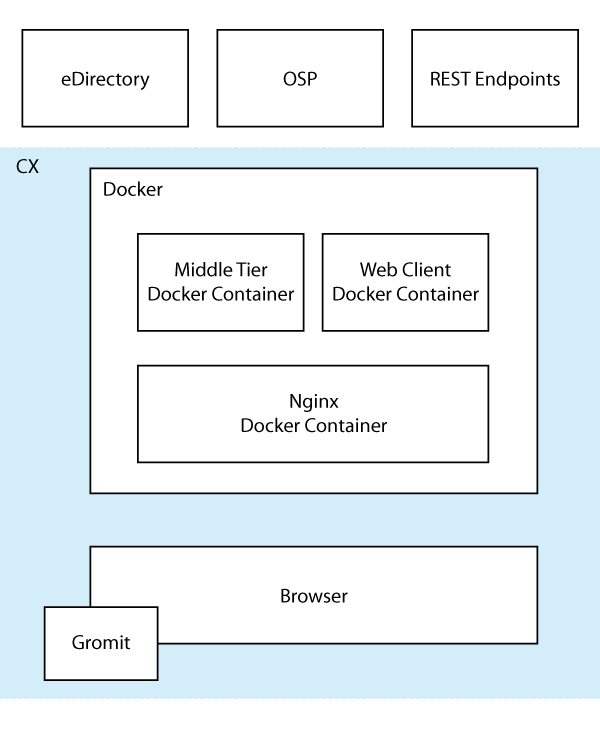

# CX-App

The CX project bridges the gap between Micro Focus APIs and the blank page.

Many Micro Focus projects have provided REST APIs that make it possible to write custom clients and create bespoke implementations.  These APIs allow you to create objects, launch reports, and so much more.

However, before you can use these APIs you need a framework.  A place to write your code with a solid UI architecture that provides build services, security integration, a common look and feel, and a container to run your application.  CX provides a set of samples and reusable code that let you stop worrying about the blank page and start solving real world problems.

## The CX architecture

CX projects have three fundamental components:

1. **Client**  The client runs with AngularJS.  It builds with Gulp and it works like a normal AngularJS application.
1. **Middle Tier**  The middle tier in the CX server is written in Python.  The middle tier makes it possible to write custom REST endpoints and do other server-side processing in CX.
1. **The Proxy** The client and the middle tier are held together in a single server by the proxy server running Nginx.  The proxy server works as a pass-through to call other REST endpoints and combines the client and middle tiers into a single server.

For more information about the CX architecture check out this video overview:

[CX Self Registration Demo Video](https://vimeo.com/226010406)

There are currently five CX projects:  

*   **hello-world** is the perfect template for a simple CX project.
*   **self-registration** shows you how to use the [ng-ias](https://github.com/MicroFocus/ng-ias) project to create a wizard for creating new users that matches the Micro Focus look and feel.
*   **self-registration-2** shows you how to create a single page application for registering new users.  This sample uses Bootstrap and Font Awesome to show you how to create a different look and feel with CX.
*   **ig-overview** shows you how to use CX to connect to REST endpoints that support OAuth2 and OSP to make authenticated REST calls to Micro Focus products like [Identity Governance](https://www.netiq.com/products/identity-governance/).
*   **token-validation** shows you how use the CX security proxy to validate tokens and secure your custom REST endpoints.
*   **aaf-enrollment** shows you how use the CX app to run new enrollment ui and run proxy for AAF intance 

To use CX clone or download the repository.  Each of those projects has a separate README file with instructions.

### Current Core Project Team Members

*   **Jon Bultmeyer** _Overall technical direction_ - Jon.Bultmeyer@microfocus.com
*	**Matt Ulery**	_Product Manager_ - Matt.Ulery@microfocus.com
*	**Rik Peters**	_Engineering Manager_ - Rik.Peters@microfocus.com
*	**Brett Berger** _Project Manager_ - Brett.Berget@microfocus.com
*	**Lyndon Washington** _Developer_ - Lyndon.Washington@microfocus.com
*	**Tony Stephens** _Developer_ - Tony.Stephens@microfocus.com
*	**Denis Nasyrov** _Developer_ - Denis.Nasyrov@microfocus.com
*	**James Albright** _Developer_ - James.Albright@microfocus.com
*	**Zack Grossbart** _Developer_ - Zack.Grossbart@microfocus.com
