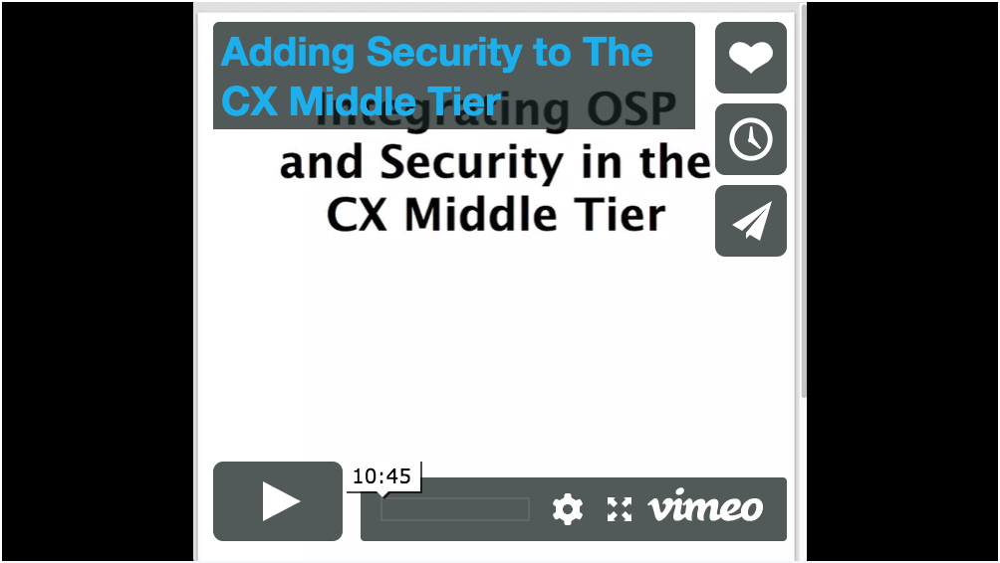
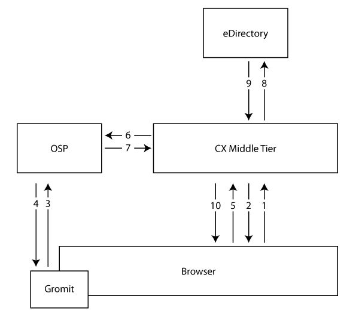

# Token Validation

This project shows how to perform token validation in the middle tier.  This sample makes a simple REST endpoint available in the middle tier and uses single sign on with OSP to provide security for that endpoint.

## Running the Application

The easiest way to run this application is with the Docker container.  Change to the docker folder and run the following command:

```
docker-compose -f docker-compose-token-validation.yml up --force-recreate --build
```

Once the Docker container starts the application will be running at http://localhost, but you must access it via the URL configured during OSP SSO client configuration.

## Watch the Video
[](https://vimeo.com/240840649)

## Configuring Your Project

This project shows how to use the middle tier OSP security proxy to validate OAuth2 tokens.  This makes it easy to secure REST endpoints in the middle tier, but first you need some configuration to support SSO.

**Step One** -  Create a new SSO client for your application.  For this example we'll call our new client `cx`.  This new client is defined in the `ism-configuration.properties` file in the `tomcat/conf` directory on the server where OSP is running.

The easiest way to add a new SSO client is to edit the `ism-configuration.properties` file by hand and add the following three properties:

```
com.netiq.cx.clientID = cx
com.netiq.cx.clientPass = secret
com.netiq.cx.redirect.url = http://192.168.0.78/oauth.html
```

Note that the client ID shows up in the property name as well as the value.

The redirect URL must point to the exact server you want to use when accessing your app in the browser.  This must have the same protocol, host, and port or it will not work.  The `oauth.html` file is generated by Gromit during your project build.

Once you have added these properties you must restart your server.

**Step Two** - Configure the OSP location in your `services.json` file.  Go to the bottom of the file and find the `auth` section.  It looks like this:

```json
"auth": [
    {
      "id": "osp",
      "type": "custom",
      "auth_header_name": "Authorization",
      "use_param": false,
      "param_name": null,
      "use_cookie": false,
      "cookie_name": null,
      "data": {
        "response_function_name": "OSPProxy.check",
        "function_source_uri": "plugins.osp.osp_security_proxy",
        "username": "cx",
        "password": "secret",
        "app": "idm",
        "target_url": "http://192.168.0.76:8080"
      }
    }
  ]
```

You will need to change the `username`, the `password`, and the `target_url`.  Use your client ID from the first step, your client secret from the first step, and the location of your OSP server respectively.

**Step Three** - Add the `auth` property to an endpoint in the `services.json` file like this:

```json
{
  "id": "users",
  "name": "Ldap users service wrapper",
  "description": "",
  "virtual": [
    {
      "response_function_name": "EDirUsersResource.read_users",
      "function_source_uri": "plugins.users.edir",
      "path": "list",
      "method": "GET"
    }
  ],
  "proxy": {
    "listen_path": "/users/",
    "target_url": null
  },
  "auth": "osp"
}
```

This property tells the middle tier to require a valid token for this endpoint.

The second step is to configure the auth section of the `services.json` file.  This is where you configure the location of your OSP server.

*You must restart your Docker container to pick up these changes.*

**Step Four** - Edit your project to tell Gromit about your OSP configuration.  You do this by setting the following JavaScript variables:

```javascript
gromit.ClientId = 'cx';
gromit.AuthUrl = 'http://192.168.0.76:8080/osp/a/idm/auth/oauth2/grant';
gromit.AuthLogoutUrl = 'http://192.168.0.76:8080/osp/a/idm/auth/app/logout';
```

You can set these properties dynamically in your code or hard-code them into your index.html file.  They just need to be set before you use Gromit to call the server.

## How It Works

This section walks you through how we make a request and validate tokens using the CX security proxy in the middle tier.



1. The browser makes a REST request to the server with no token.
1. The middle tier returns 401 (Unauthorized) because the request has no token.
1. Gromit intercepts the 401 response and redirects to OSP in an iFrame.
1. The user logs in to OSP and is granted a token.
1. Gromit replays the request from step one with a valid token.
1. The middle tier calls OSP to validate the token.
1. OSP inspects the token and returns that it is valid.  If the token has timed out or isn't valid then the middle tier will return a 401 response and this process will return to step three.
1. Now that the token is valid the middle tier transfers control to the specific REST endpoint which calls to eDirectory using an admin credential.
1. eDirectory returns the data to the REST endpoint.
1. The REST endpoint formats the data as JSON and returns it to the browser.

Gromit will continue to use this token until the token expires or the user logs out.  At that point the process will start over with step one.

## Building the Client Side Separately
You can build the client-side of this application separately.  You don't have to, but it can sometimes be useful to see better build errors.

### Node Package Manager
This sample requires the [Node Package Manager](https://www.npmjs.com).  The best way to get the Node Package Manager is to install [Node.js](https://nodejs.org/en).  

After you have installed the Node Package Manager you can install the project dependencies with this command:

```
npm install
```

### Gulp
This application builds with [Gulp](http://gulpjs.com).  Use the following commands to install Gulp:

```
npm install gulp-cli -g
npm install gulp -D
```

## Development

These are the commands to build the project:

* `gulp` - Starts development environment (development build, file watchers, and server).  The server will be running at http://localhost:8080.
* `gulp build:development` - Development build. This build is optimized for speed. Writes files to `dist/` by 
default
* `gulp build:production` - Production build. This build is optimized for size and quality of output. Writes 
files to `dist/` by default
* `gulp clean` - Cleans all built assets by removing `dist/`